# 🏛️ DOGE Savings Dashboards

**DOGE Savings Dashboards** is a fully integrated, end-to-end data analytics pipeline built with Python and Streamlit, designed to deliver real-time insights into U.S. government cost savings from contract and grant cancellations.

🔎 Powered by the **DOGE API** (Department of Government Efficiency), this platform connects live federal data with intuitive visualizations and downloadable reporting—ideal for analysts, watchdogs, policy teams, and transparency advocates.

---

https://dogesavings.streamlit.app/

---

## 💡 What Makes It an End-to-End Pipeline?

This solution automates the entire analytics lifecycle:

| **Stage**            | **Capability**                                                                 |
|----------------------|---------------------------------------------------------------------------------|
| **Ingestion**        | Pulls live data from DOGE’s paginated REST API with configurable filters        |
| **Transformation**   | Cleans, parses, and enriches data into period-based metrics and trends          |
| **Exploration**      | Interactive dashboards using Plotly and Streamlit for dynamic slicing           |
| **Insight Generation** | Auto-generates descriptive insights and summaries across entities              |
| **Export & Distribution** | PDF reports with embedded charts, summary tables, and stakeholder context   |
| **Reproducibility**  | All logic is scripted in notebooks and `.py` files for repeatable use          |

---

## 🎯 Value Proposition

This project offers:

✅ **Zero manual ETL** – all data is pulled and preprocessed live  
📈 **Instant insight** – understand agency performance and vendor impact in real-time  
📝 **One-click reporting** – generate shareable PDFs with metrics and visuals  
🧠 **Built-in storytelling** – includes automated insights, outliers, and trends  
🤝 **Stakeholder-ready outputs** – easy exports, clear narratives, and polished visuals  

Whether you're building transparency tools, supporting federal audits, or prototyping public-sector analytics apps, this dashboard is a plug-and-play solution with clear extensibility.

---

## ✨ Why this project matters

- ✅ Brings **transparency** to government spending reductions  
- 📊 Enables **visual storytelling** with automated charts and insights  
- 📁 Produces **professional-grade PDF summaries** for distribution  
- 🧠 Leverages **automated analysis** to surface savings trends and top contributors  
- ⚙️ Designed to be easily **extended** with future data sources like payments  

This dashboard is designed to serve as both a **public transparency tool** and an **internal decision support resource** — fully open source and customizable.


---

## 📦 Features

- 🔄 **Live API Integration** with pagination and filtering
- 📊 **Interactive Visuals** (via Plotly):
  - Top 10 agencies and vendors
  - Monthly and weekday savings trends
  - Per-record average savings
- 🧠 **Automated Insights** included in PDF report
- 📄 **PDF Report Generation** with:
  - Embedded charts
  - Summary metrics
  - Agency- and vendor-level breakdowns
  - 📈 **Forecast-ready** time-series data
- 📄 **PDF Desk Guide** auto-generated with embedded visuals
- 📥 **CSV Downloads** of live or filtered data

---

## 🗂️ Project Structure

```
📦 doge-dashboard/
├── Home.py
├── pages/
│   ├── 01_DOGE Contract Savings.py      # Streamlit app for contracts
│   ├── 02_DOGE Grants Savings.py        # Streamlit app for grants
├── requirements.txt                 # Python dependencies
├── README.md                        # Project documentation
├── DOGE_Savings_Dashboard_DeskGuide.pdf  # Visual walkthrough (autogenerated)
├── images/
│   ├── home.png
│   ├── dashboard_contracts.png
│   ├── contracts_top10agencies.png
│   ├── contracts_top10vendors.png
│   ├── contracts_monthlysavings.png
│   ├── contracts_weekdaycancellations.png
│   ├── dashboard_grants.png
│   ├── grants_top10agencies.png
│   ├── grants_highimpacts.png
│   ├── grants_monthlysavings.png
│   ├── grants_weekdaycancellations.png
```
```

---

## 🚀 How to Run Locally

1. Clone this repo:

```bash
git clone https://github.com/RichieGarafola/DOGEContractSavings.git
cd doge-dashboard
```

2. Create a virtual environment and install dependencies:

```bash
pip install -r requirements.txt
```

3. Run a dashboard:

```bash
streamlit run 01_DOGE\ Contract\ Savings.py
# or
streamlit run 02_DOGE\ Grants\ Savings.py
```

---

## 🔍 API Data Sources

- **Contracts**: `/savings/contracts`
- **Grants**: `/savings/grants`

All dashboards rely on paginated GET requests to live JSON endpoints.  
📄 API Spec: [https://api.doge.gov/openapi.json](https://api.doge.gov/openapi.json)

---

## 🧪 Requirements

```text
streamlit
pandas
plotly
requests
reportlab
```

Install via:

```bash
pip install -r requirements.txt
```

---

## 📊 Visual Examples

| Chart | Description |
|-------|-------------|
| **Top 10 Agencies** | Horizontal bar of agencies with highest savings |
| **Top Vendors**     | Shows most-impacted vendors by value |
| **Quarterly Trend** | Tracks contract savings over time |
| **Weekday Cancellations** | Shows behavioral cancellation trends |
| **Histogram**       | Distribution of contract savings |

---


## 📄 Visual Reporting

Both dashboards generate downloadable PDFs featuring:

- Cover page
- Summary & automated insights
- Embedded charts
- Agency/vendor savings tables
- Footer with creator details

Ideal for **stakeholder review** or **presentation handouts**.

---

## 📸 Screenshots

### 🏠 Home  
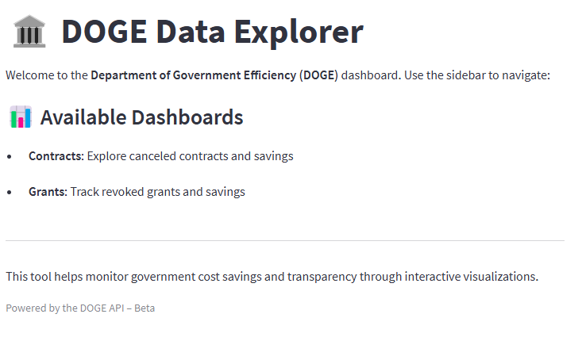

---

### 📊 Contract Dashboard  
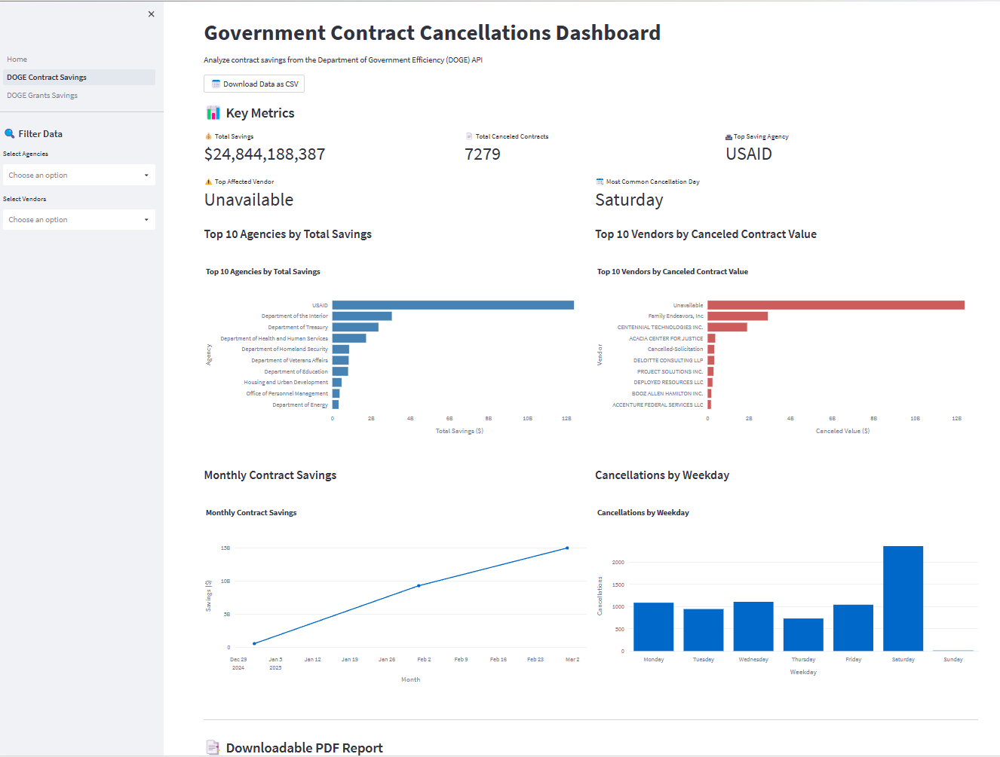

**Top 10 Agencies**  
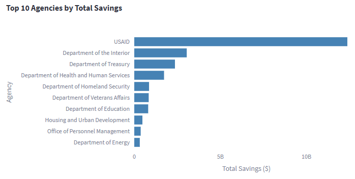

**Top 10 Vendors**  
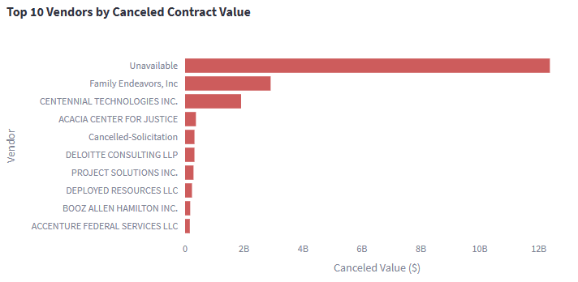

**Monthly Savings**  
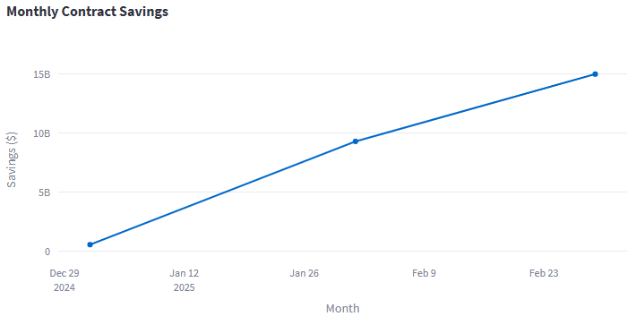

**Weekday Cancellations**  
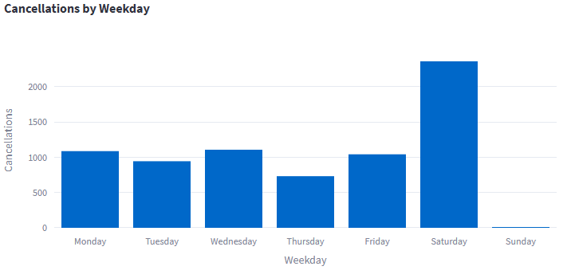

---

### 🧾 Grant Dashboard  
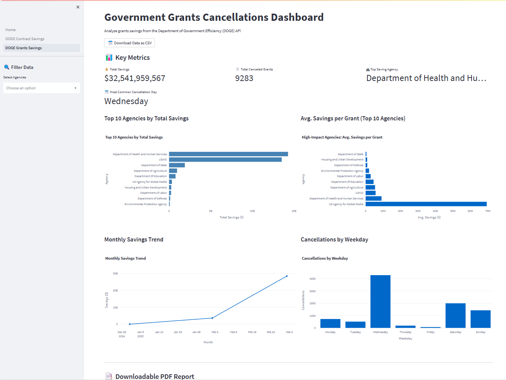

**Top 10 Agencies**  
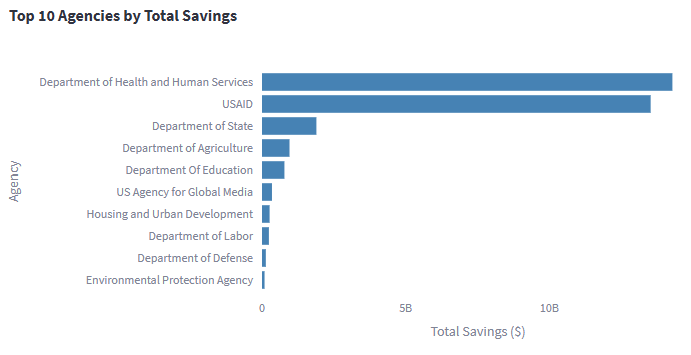

**High Impact Grants**  
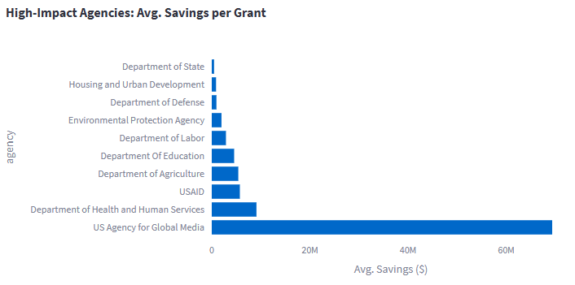

**Monthly Savings**  
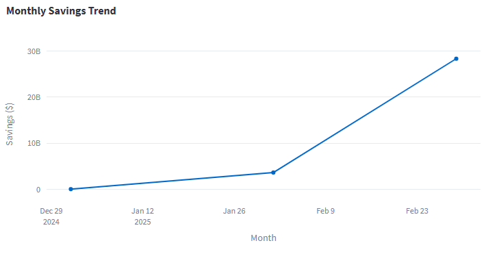

**Weekday Cancellations**  
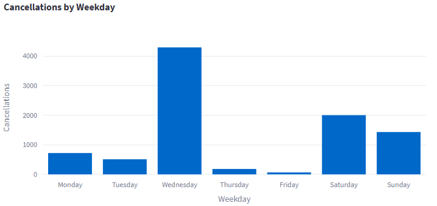

---


## 🧩 Future Enhancements

- Payment-level analytics
- Date-range filtering
- Categorized grant/contract types
- Trendline forecasting
- Agency tag clouds

---

## 👤 Creator

**Richie Garafola**  
📧 RichieGarafola@hotmail.com  
🔗 [github.com/RichieGarafola](https://github.com/RichieGarafola)
